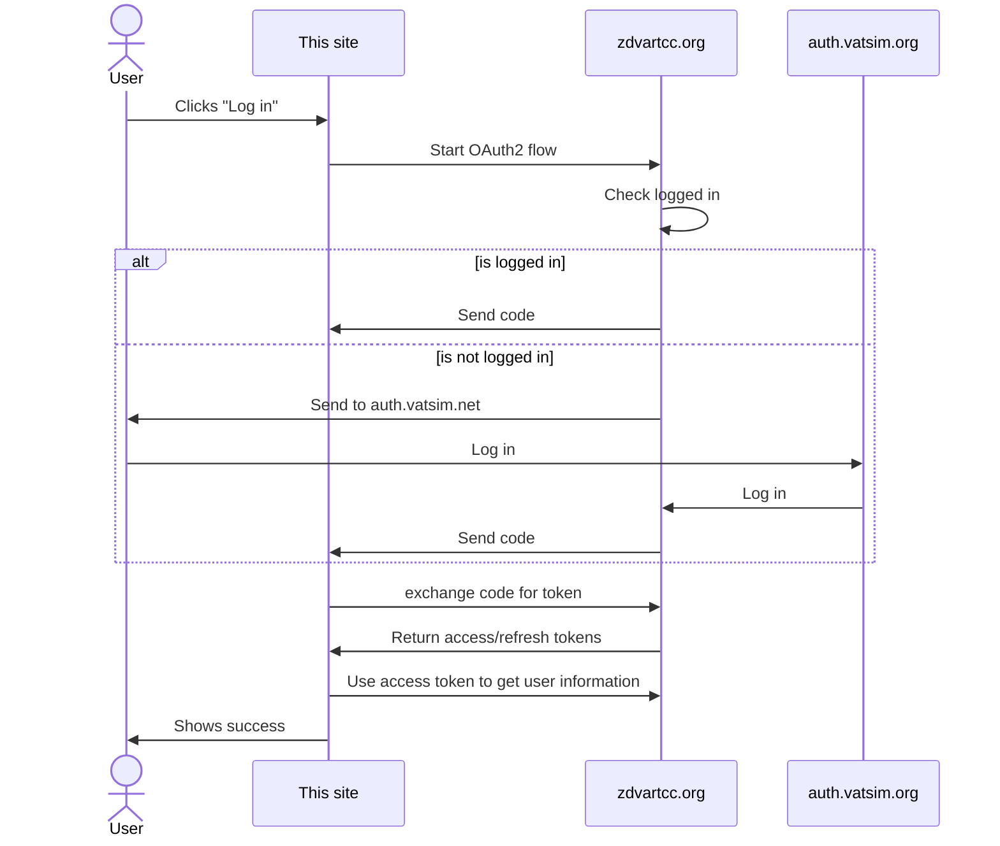
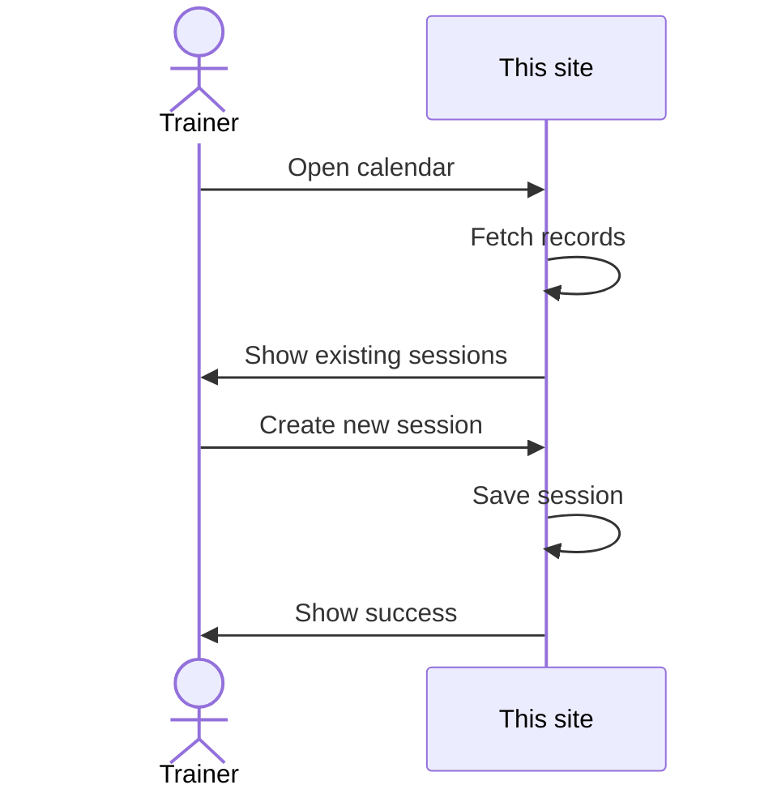
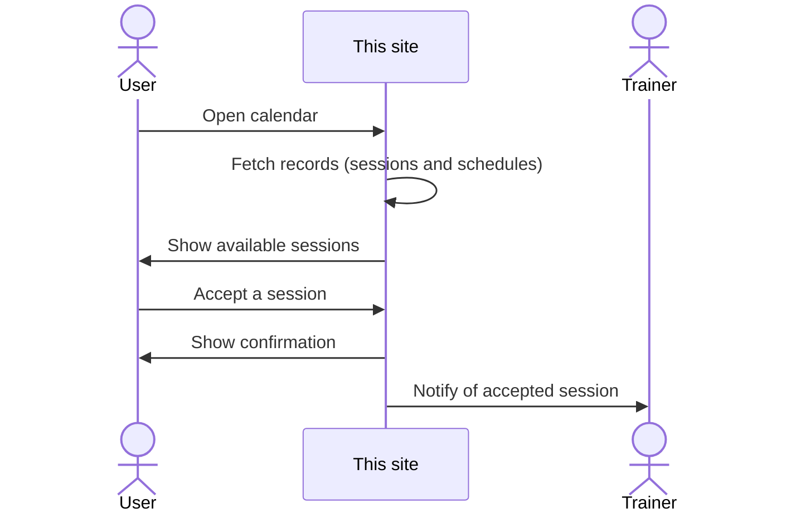
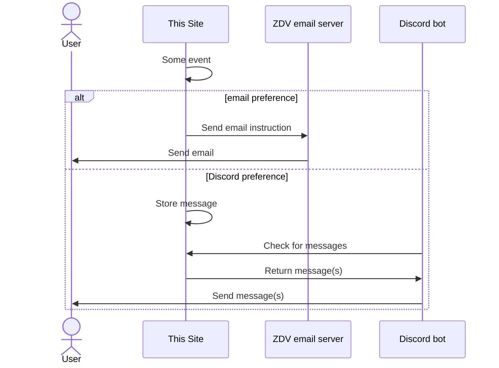
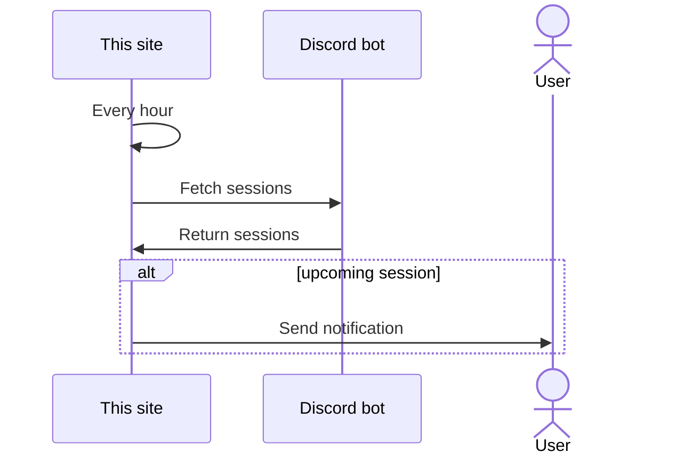
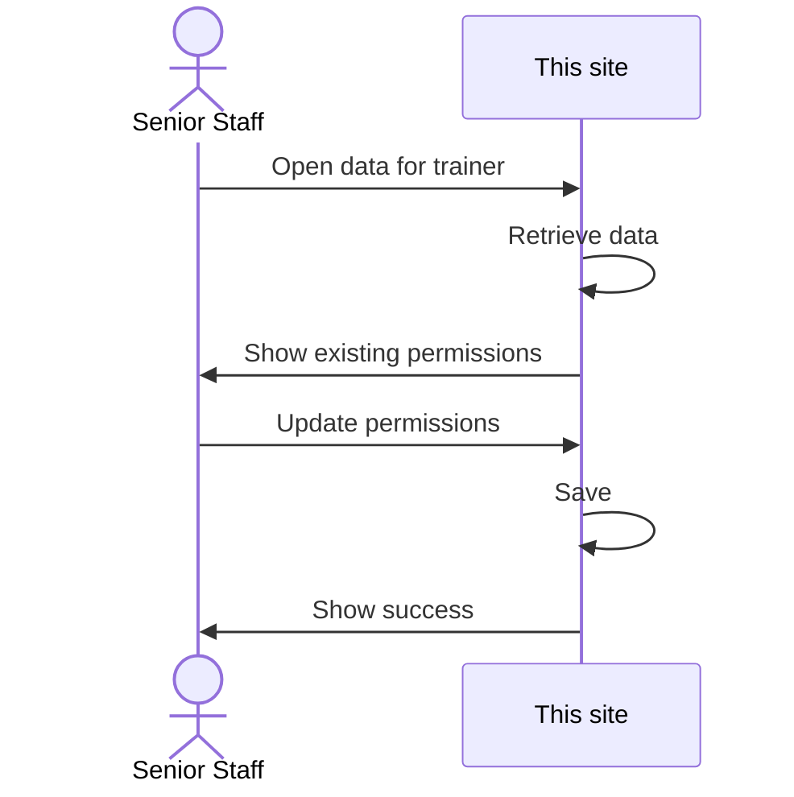

# zdv-training-scheduler

Website and Discord bot for scheduling training sessions for the [VATSIM Denver ARTCC](https://zdvartcc.org/).

## Tech

- [Astro](https://astro.build/)
- [Tailwind](https://tailwindcss.com/) with help from [Flowbite](https://flowbite.com/)
- [React](https://react.dev/)
- [Prisma](https://www.prisma.io/)
- [SQLite](https://www.sqlite.org/index.html)
- [TypeScript](https://www.typescriptlang.org/)
- [Node](https://nodejs.org/en)
- [Discord.js](https://discord.js.org/)
- [Bun](https://bun.sh/)

This is first and foremost an Astro project, allowing the site to utilize [SSR](https://docs.astro.build/en/guides/server-side-rendering/) to build a [MPA](https://docs.astro.build/en/concepts/why-astro/#server-first) site (rather than SPA from just React) with backend included. React is used for client-side functionality. Prisma and SQLite provide storage. OAuth via ZDV provides authentication and authorization.

The Discord bot portion of this project is for users who wish to receive notifications via Discord rather than / in addition to email. The bot runs, checking for pending messages on the site every minute, and dispatches them to the correct Discord users, marking each message complete thereafter.

### Requirements

A quick note about a requirements: this site relies on the [ADH Partnership](https://github.com/adh-partnership) backend and auth that powers ZAN, ZDV, ZLC, and other VATIM ARTCC websites. That is, while this entire project is FOSS and you're welcome to run it wherever you like, unless your ARTCC is running that entire setup, this project won't have anything to talk to and be effectively useless.

If you're interested in breaking out of that requirement, please reach out to me.

## Architecture / Flows

### Log in

### Create a session

### Accept a session

### Async site-to-user communication

The site needs to be able to send users, both learners and trainers, messages when that user is not
on the site and an event impacts them. Notably, the site needs to be able to inform users if their
session is accepted or cancelled.

Also, Discord will send notifications to users 1 hour before their session.

### Update trainer permissions

Only the TA (and (D)ATM) can update permissions for Mentors and Instructors on which permissions they are allowed to train students on the positions configured in the config file.

When Senior Staff update the permissions for a trainer, all of their open sessions are updated to show the increased training opportunities.

## Building

### Site

1. Install Node 16.12.0 or later
1. Run `npm ci` to install dependencies
1. Prepare the configuration by copying ".config.example.toml" to ".config.toml" and populate
1. Run `npm run dev` to run the dev server

### Bot

1. Install [Bun](https://bun.sh/)
1. Create a [Discord bot](https://discord.com/developers/applications)
1. Create a ".env" file or otherwise supply "SITE_URL", "SITE_TOKEN", and "DISCORD_BOT_TOKEN" env vars
1. Run with `bun run dev`

### Deploying

#### Site

These steps will create a Docker image, push it to your server, push a [systemd](https://en.wikipedia.org/wiki/Systemd) service file to the server, load the service into systemd, start it, and enable it starting on server start.

1. Create & fill out a ".config.toml" file
1. Change the name of the Docker image in "site/package.json" scripts
1. `npm run docker:build && npm run docker:push`
1. `ssh <your_ssh_target>`
1. `docker pull <you>/zdv-training-scheduler`
1. Update the "systemd.service" file with your image name
1. Push the "systemd.service" file to your server at `/etc/systemd/system/zdv-training-scheduler.service`
1. On the server, run `systemctl daemon-reload && systemctl enable --now zdv-training-scheduler.service`

#### Bot

1. `bun run docker:build && bun run docker:push`
1. `ssh <your_ssh_target>`
1. `docker pull <you>/zdv-training-scheduler-bot`
1. Update the "systemd.service" file with your image name
1. Push the "systemd.service" file to your server at `/etc/systemd/system/zdv-training-scheduler-bot.service`
1. Fill out that new file on the server with the 3 required env vars
1. On the server, run `systemctl daemon-reload && systemctl enable --now zdv-training-scheduler-bot.service`

## Contribution

Please feel free to contribute. Do note that this project could be running for several VATSIM ARTCCs, and anything that those Senior Staff don't want will be up for discussion rather than certain merge. Please open an issue first (or comment on an existing one) so that I know that you want to add/change something.

## License

- Project under MIT or Apache-2.0
- Libraries in use under their respective licenses
