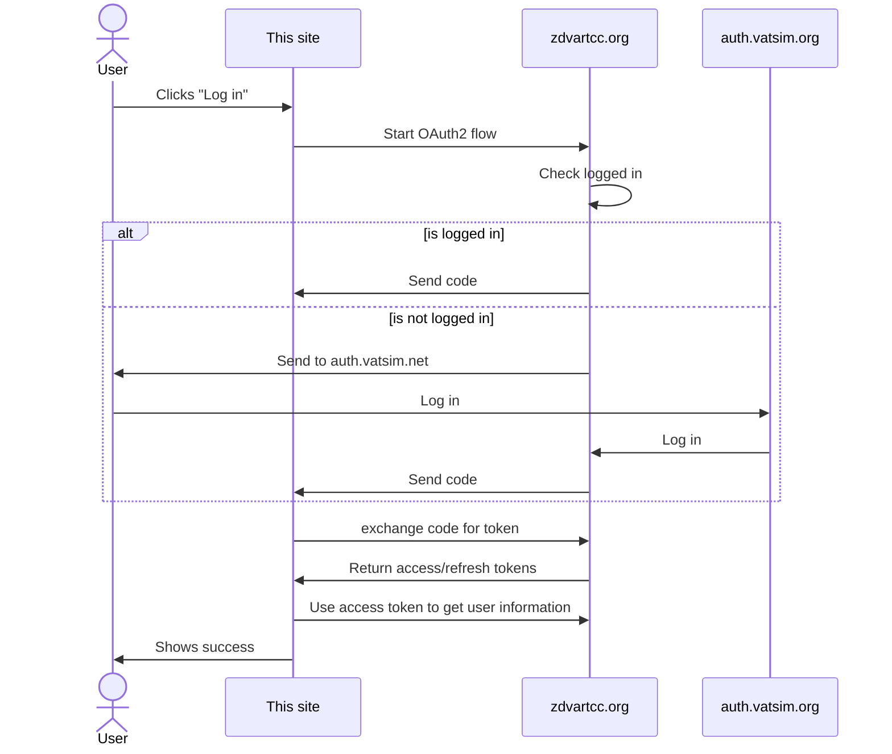
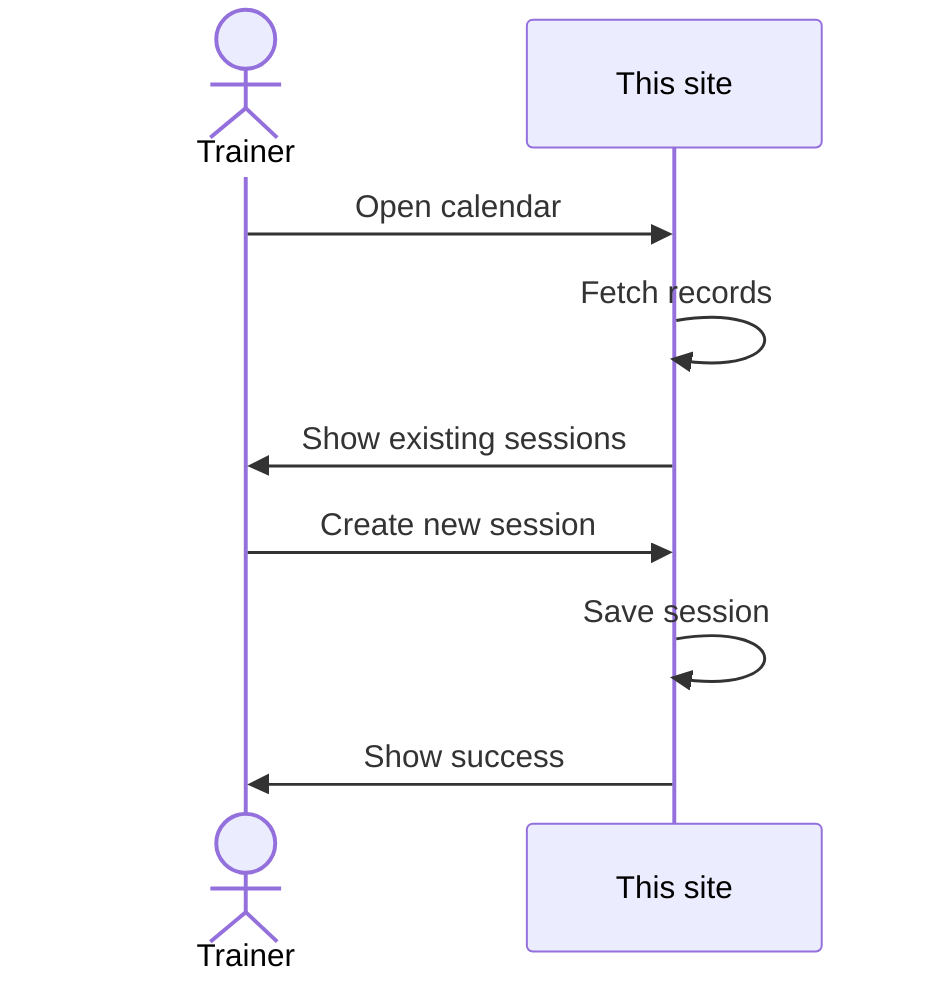
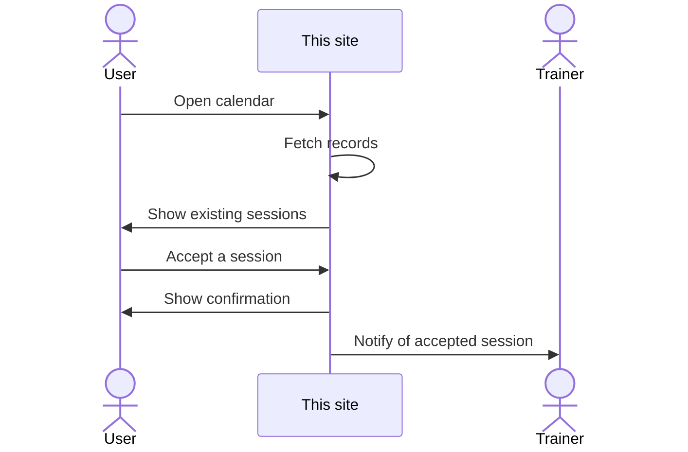
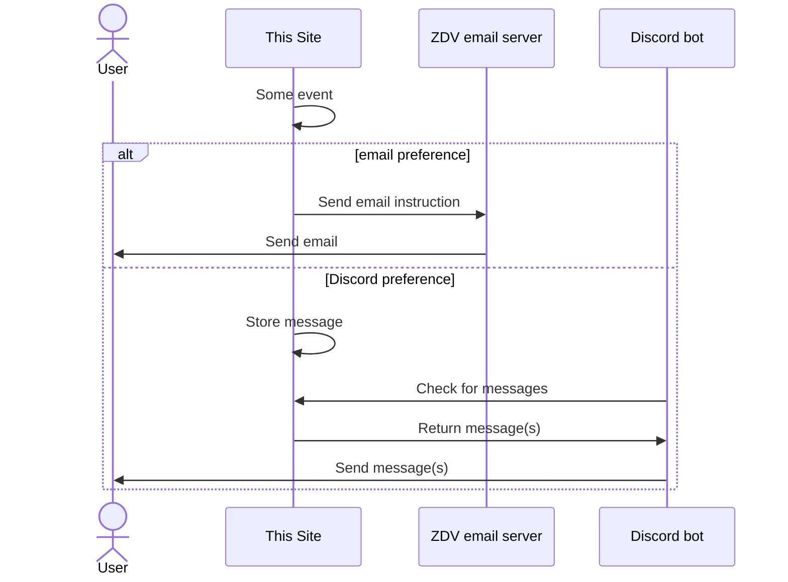
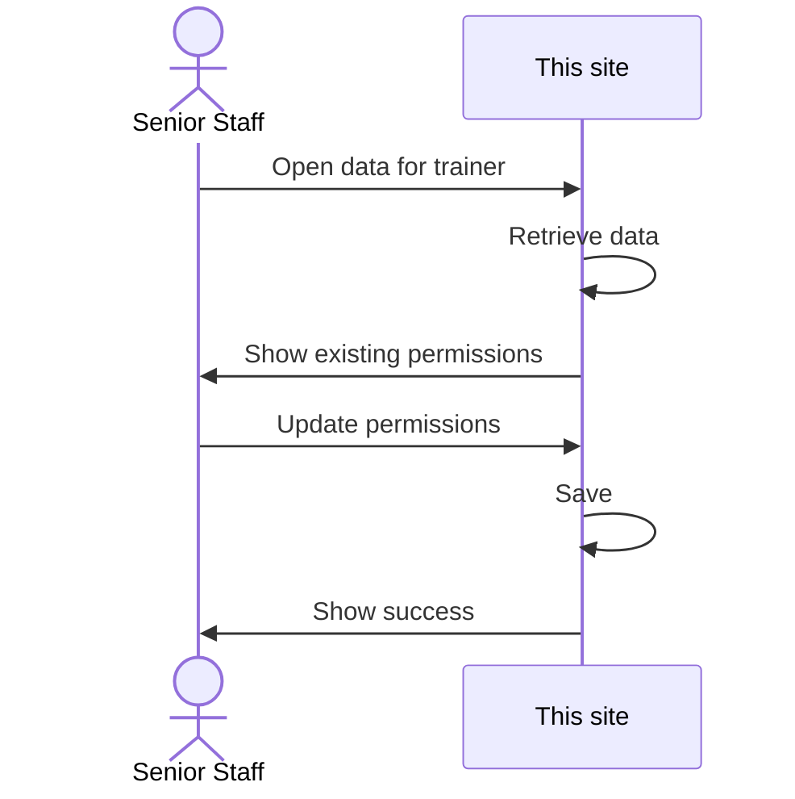

# zdv-training-scheduler

Website and Discord bot for scheduling training sessions for the [VATSIM Denver ARTCC](https://zdvartcc.org/).

## Tech

- [Astro](https://astro.build/)
- [Tailwind](https://tailwindcss.com/) with help from [Flowbite](https://flowbite.com/) and [Realtime Colors](https://realtimecolors.com/)
- [React](https://react.dev/)
- [Prisma](https://www.prisma.io/)
- [SQLite](https://www.sqlite.org/index.html)
- [TypeScript](https://www.typescriptlang.org/)
- [Node](https://nodejs.org/en)

This is first and foremost an Astro project, allowing the site to utilize [SSR](https://docs.astro.build/en/guides/server-side-rendering/) to build a [MPA](https://docs.astro.build/en/concepts/why-astro/#server-first) site (rather than SPA from just React) with backend included. React is used for client-side functionality. Prisma and SQLite provide storage. OAuth via ZDV provides authentication and authorization. Once [Bun](https://bun.sh/) in Astro stabilizes, this project will likely uptake it to replace Node.

## Architecture / Flows

### Log in

### Create a session

### Accept a session

### Async site-to-user communication

The site needs to be able to send users, both learners and trainers, messages when that user is not
on the site and an event impacts them. Notably, the site needs to be able to inform users if their
session is accepted or cancelled.

### Update trainer permissions

Only the TA (and (D)ATM) can update permissions for Mentors and Instructors on which permissions they are allowed
to train students on:

- Minor Ground
- Major Ground
- Minor Tower
- Major Tower
- Minor Approach
- Major Approach
- Center

When Senior Staff update the permissions for a trainer, all of their open sessions
are updated to show the increased training opportunities.

## Building

1. Install Node 16.12.0 or later
1. Clone the repo
1. Run `npm ci` to install dependencies
1. Prepare the configuration by copying ".config.example.toml" to ".config.toml" and populate
1. Run `npm run dev` to run the dev server

### Deploying

WIP.

## Contribution

This project is currently not open to outside contributions as it is actively in-dev.

## License

- Project under MIT or Apache-2.0
- Libraries in use under their respective licenses
